# 🏗️ تحليل نظام إدارة مشاريع المقاولات والتشطيبات — SaaS v2.0

> [!NOTE]
> النسخة المحدّثة بعد مراجعة وملاحظات المالك — تم دمج جميع التعديلات والاقتراحات

---

## 1. فهم النظام العام (System Overview)

النظام هو منصة **Multi-tenant SaaS** تعمل كجسر تواصل وتوثيق بين ثلاثة أطراف رئيسية. النظام مصمم ليخدم **آلاف الشركات** و**ملايين المستخدمين** بأمان وأداء عالٍ.

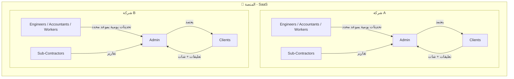

### الفلسفة الأساسية

| المبدأ | الشرح |
|---|---|
| **الشفافية** | العميل يرى كل شيء تمت الموافقة عليه — لا مفاجآت |
| **التوثيق** | كل عمل موثق بصور وتقارير وتكاليف — حماية قانونية لكلا الطرفين |
| **التحكم** | الشركة تتحكم فيما يُعرض للعميل عبر آلية المراجعة |
| **العزل** | كل شركة (Tenant) معزولة تمامًا عن الأخرى |
| **التواصل الموثّق** | كل التواصل يتم داخل النظام (شات + تعليقات) — لا حاجة لـ WhatsApp |
| **الالتزام بالمواعيد** | نظام مواعيد تسليم التحديثات مع إشعارات تلقائية للتأخير |

---

## 2. تفكيك الكيانات (Entity Breakdown)

### 2.1 🏢 Company (الشركة / Tenant)

الكيان الجذري في النظام. كل شيء ينتمي لشركة.

| السمة | النوع | ملاحظات |
|---|---|---|
| `id` | UUID | المعرف الفريد |
| `name` | String | اسم الشركة |
| `slug` | String (unique) | للروابط الفريدة |
| `logo` | URL | شعار الشركة |
| `phone` | String | رقم التواصل |
| `email` | String | البريد الرسمي |
| `address` | String | العنوان |
| `subscription_plan` | Enum | خطة الاشتراك (basic, pro, enterprise) |
| `subscription_status` | Enum | حالة الاشتراك (active, expired, trial) |
| `storage_quota` | BigInt | حصة التخزين بالبايت (تعتمد على الخطة) |
| `storage_used` | BigInt | التخزين المستخدم |
| `currency` | String | العملة (EGP, SAR, AED...) |
| `timezone` | String | المنطقة الزمنية |
| `settings` | JSONB | إعدادات مخصصة |
| `created_at` | Timestamp | تاريخ الإنشاء |
| `deleted_at` | Timestamp (nullable) | Soft delete |

> [!IMPORTANT]
> الشركة هي **Tenant Boundary** — كل query في النظام يجب أن يمر عبر فلتر `company_id` لضمان عزل البيانات.

---

### 2.2 👤 User (المستخدم)

| السمة | النوع | ملاحظات |
|---|---|---|
| `id` | UUID | المعرف الفريد |
| `company_id` | FK → Company | الشركة التابع لها |
| `name` | String | الاسم الكامل |
| `email` | String (unique per company) | البريد الإلكتروني |
| `phone` | String | رقم الهاتف |
| `role` | Enum | الدور (راجع قسم الصلاحيات المفصّل) |
| `avatar` | URL | الصورة الشخصية |
| `is_active` | Boolean | فعّال أم لا |
| `notification_preferences` | JSONB | تفضيلات الإشعارات (متى يستلم، أي قنوات) |
| `preferred_language` | Enum | `ar` أو `en` |
| `last_login` | Timestamp | آخر دخول |
| `created_at` | Timestamp | تاريخ الإنشاء |
| `deleted_at` | Timestamp (nullable) | Soft delete |

> [!NOTE]
> العميل (`client`) يمكنه:
> - متابعة المشروع ورؤية التحديثات المعتمدة
> - إضافة تعليقات على التحديثات
> - طلب مراجعة على التفاصيل اليومية
> - فتح شات مباشر مع أي شخص في الفريق (مهندس، محاسب، مدير)

---

### 2.3 📋 Project (المشروع)

| السمة | النوع | ملاحظات |
|---|---|---|
| `id` | UUID | المعرف الفريد |
| `company_id` | FK → Company | الشركة المالكة |
| `client_id` | FK → User | العميل المرتبط |
| `name` | String | اسم المشروع |
| `description` | Text | وصف المشروع |
| `location` | String | موقع المشروع |
| `type` | Enum | نوع المشروع (تشطيب كامل، جزئي، إنشائي...) |
| `status` | Enum | `draft`, `in_progress`, `on_hold`, `completed`, `cancelled` |
| `start_date` | Date | تاريخ البدء |
| `expected_end_date` | Date | التاريخ المتوقع للانتهاء |
| `actual_end_date` | Date | التاريخ الفعلي للانتهاء |
| `total_budget` | Decimal | الميزانية الإجمالية |
| `overall_progress` | Integer (0-100) | نسبة الإنجاز الكلية (محسوبة تلقائيًا) |
| `daily_update_deadline` | Time | الموعد اليومي المتفق عليه لتسليم التحديثات |
| `created_at` | Timestamp | تاريخ الإنشاء |
| `deleted_at` | Timestamp (nullable) | Soft delete |

---

### 2.4 👥 ProjectAssignment (تعيين الموظفين على المشاريع)

جدول ربط Many-to-Many بين المشروع والموظفين.

| السمة | النوع | ملاحظات |
|---|---|---|
| `id` | UUID | المعرف الفريد |
| `project_id` | FK → Project | المشروع |
| `user_id` | FK → User | الموظف |
| `role_in_project` | Enum | `site_engineer`, `supervisor`, `accountant`, `worker`, `foreman` |
| `is_required_daily_update` | Boolean | هل مطلوب منه تحديث يومي؟ |
| `assigned_at` | Timestamp | تاريخ التعيين |
| `removed_at` | Timestamp (nullable) | تاريخ الإزالة |

> [!IMPORTANT]
> هذا الجدول يحدد **من** مطلوب منه تحديث يومي. نظام المواعيد سيتحقق من هذا الحقل لإرسال إشعارات التأخير.

---

### 2.5 🔧 Project Phase (مرحلة المشروع)

| السمة | النوع | ملاحظات |
|---|---|---|
| `id` | UUID | المعرف الفريد |
| `project_id` | FK → Project | المشروع التابعة له |
| `name` | String | اسم المرحلة (كهرباء، سباكة، نقاشة...) |
| `description` | Text | وصف المرحلة |
| `order` | Integer | ترتيب المرحلة |
| `weight` | Integer | وزن المرحلة في حساب الإنجاز الكلي |
| `status` | Enum | `not_started`, `in_progress`, `completed`, `on_hold` |
| `progress` | Integer (0-100) | نسبة الإنجاز (محسوبة تلقائيًا + قابلة للتعديل من الأدمن) |
| `start_date` | Date | تاريخ البدء |
| `expected_end_date` | Date | التاريخ المتوقع |
| `budget` | Decimal | ميزانية المرحلة |
| `actual_cost` | Decimal | التكلفة الفعلية (محسوبة) |
| `created_at` | Timestamp | تاريخ الإنشاء |
| `deleted_at` | Timestamp (nullable) | Soft delete |

---

### 2.6 📝 Update (التحديث / التقرير اليومي)

هذا هو **قلب النظام** — كل موظف معيّن على المشروع يرسل تحديثه (مهندس، محاسب، مشرف...).

| السمة | النوع | ملاحظات |
|---|---|---|
| `id` | UUID | المعرف الفريد |
| `phase_id` | FK → Phase | المرحلة التابع لها |
| `submitted_by` | FK → User | الموظف الذي أدخل التحديث |
| `reviewed_by` | FK → User (nullable) | الأدمن الذي راجع |
| `title` | String | عنوان مختصر |
| `description` | Text | وصف تفصيلي لما تم |
| `work_done` | Text | ما تم إنجازه |
| `work_remaining` | Text | المتبقي |
| `workers_count` | Integer | عدد العمال |
| `work_hours` | Decimal | ساعات العمل |
| `materials_used` | JSONB | المواد المستخدمة |
| `cost` | Decimal | تكلفة هذا التحديث |
| `progress_increment` | Integer | نسبة التقدم المضافة |
| `status` | Enum | `draft`, `pending`, `approved`, `rejected`, `force_cancelled` |
| `rejection_reason` | Text (nullable) | سبب الرفض |
| `force_cancel_reason` | Text (nullable) | سبب الإلغاء القسري |
| `force_cancelled_by` | FK → User (nullable) | السوبر أدمن الذي ألغى |
| `is_locked` | Boolean | مقفل بعد 24 ساعة من الموافقة |
| `locked_at` | Timestamp (nullable) | وقت القفل |
| `submitted_at` | Timestamp | وقت الإرسال |
| `reviewed_at` | Timestamp (nullable) | وقت المراجعة |
| `deleted_at` | Timestamp (nullable) | Soft delete |

#### دورة حياة التحديث

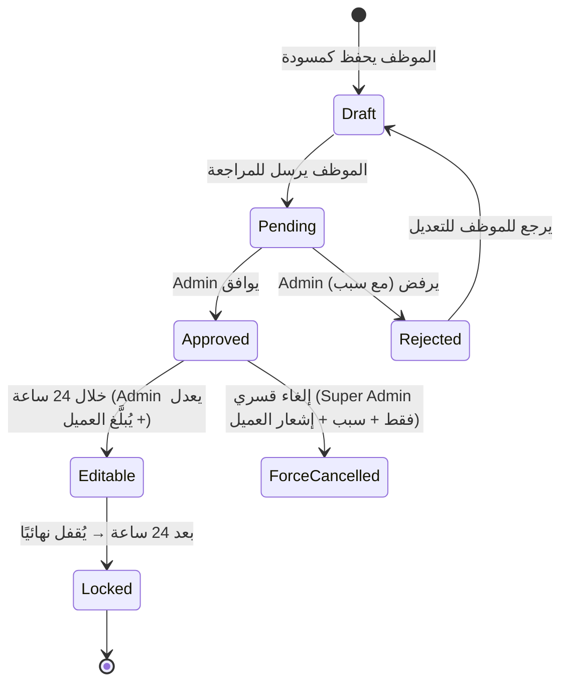

> [!IMPORTANT]
> ### قواعد التحديث بعد الموافقة
> - **خلال 24 ساعة**: الأدمن يمكنه التعديل البسيط مع إرسال إشعار للعميل بالتعديل
> - **بعد 24 ساعة**: التحديث يتقفل نهائيًا (`is_locked = true`) ولا يمكن تعديله
> - **الإلغاء القسري**: فقط `super_admin` يمكنه إلغاء تحديث معتمد في ظروف قهرية، مع توثيق اسمه وسبب الإلغاء وإبلاغ العميل

> [!CAUTION]
> ### التحديث المرفوض لا يُحذف أبدًا
> - التحديث المرفوض **يجب** أن يُعدّل ويُعاد إرساله
> - لا يمكن حذف تحديث فيه مصاريف تمت
> - في حالة الإلغاء القسري مع مصاريف: تُسجّل المصاريف كـ `sunk_cost` ويُبلَّغ العميل والسوبر أدمن

---

### 2.7 📸 Media (الوسائط)

| السمة | النوع | ملاحظات |
|---|---|---|
| `id` | UUID | المعرف الفريد |
| `update_id` | FK → Update | التحديث المرتبط |
| `type` | Enum | `image`, `video`, `document` |
| `url` | URL | رابط الملف |
| `thumbnail_url` | URL (nullable) | صورة مصغرة |
| `file_size` | Integer | حجم الملف بالبايت |
| `original_file_size` | Integer | الحجم الأصلي قبل الضغط |
| `mime_type` | String | نوع الملف |
| `caption` | String (nullable) | وصف الصورة |
| `order` | Integer | ترتيب العرض |
| `uploaded_at` | Timestamp | وقت الرفع |

---

### 2.8 💰 Payment (المدفوعات)

| السمة | النوع | ملاحظات |
|---|---|---|
| `id` | UUID | المعرف الفريد |
| `project_id` | FK → Project | المشروع |
| `amount` | Decimal | المبلغ |
| `type` | Enum | `client_payment`, `expense`, `sunk_cost` |
| `method` | Enum | `cash`, `bank_transfer`, `check`, `other` |
| `description` | Text | وصف الدفعة |
| `date` | Date | التاريخ |
| `receipt_url` | URL (nullable) | صورة الإيصال |
| `recorded_by` | FK → User | من سجل الدفعة |
| `created_at` | Timestamp | تاريخ التسجيل |
| `deleted_at` | Timestamp (nullable) | Soft delete |

---

### 2.9 🔔 Notification (الإشعارات)

| السمة | النوع | ملاحظات |
|---|---|---|
| `id` | UUID | المعرف الفريد |
| `user_id` | FK → User | المستخدم المستلم |
| `type` | Enum | أنواع كثيرة (انظر أدناه) |
| `title` | String | عنوان الإشعار |
| `body` | Text | محتوى الإشعار |
| `reference_type` | String | نوع المرجع |
| `reference_id` | UUID | ID المرجع |
| `priority` | Enum | `low`, `normal`, `high`, `urgent` |
| `channel` | Enum | `in_app`, `push`, `email`, `sms` |
| `is_read` | Boolean | هل قُرئ؟ |
| `scheduled_for` | Timestamp (nullable) | وقت الإرسال (لجدولة الإشعارات) |
| `created_at` | Timestamp | وقت الإنشاء |

**أنواع الإشعارات:**

| النوع | المستلم | الأولوية |
|---|---|---|
| `update_submitted` | Admin | Normal |
| `update_approved` | Employee + Client | Normal |
| `update_rejected` | Employee | High |
| `update_force_cancelled` | Client + Employee | Urgent |
| `update_edited_after_approval` | Client | High |
| `update_deadline_warning` | Employee | High |
| `update_deadline_missed` | Admin | Urgent |
| `payment_recorded` | Admin + Client | Normal |
| `phase_completed` | Client + Admin | Normal |
| `new_chat_message` | Target User | Normal |
| `new_comment` | Relevant Users | Normal |
| `change_request` | Admin | High |
| `project_milestone` | Client | Normal |
| `sla_breach` | Admin | Urgent |

> [!TIP]
> العميل يحدد في `notification_preferences` متى يستلم الإشعارات (فورًا، ملخص يومي، أوقات محددة). النظام يحترم هذه التفضيلات.

---

### 2.10 💬 Chat System (نظام الشات)

كيان جديد بالكامل — يتيح للعميل التواصل المباشر مع أي شخص في فريق المشروع.

#### ChatRoom (غرفة المحادثة)

| السمة | النوع | ملاحظات |
|---|---|---|
| `id` | UUID | المعرف الفريد |
| `project_id` | FK → Project | المشروع المرتبط |
| `type` | Enum | `direct` (1-1), `group` (مجموعة) |
| `name` | String (nullable) | اسم المجموعة (للمجموعات فقط) |
| `created_by` | FK → User | من أنشأ المحادثة |
| `created_at` | Timestamp | وقت الإنشاء |

#### ChatParticipant (المشاركين)

| السمة | النوع | ملاحظات |
|---|---|---|
| `id` | UUID | المعرف الفريد |
| `room_id` | FK → ChatRoom | الغرفة |
| `user_id` | FK → User | المستخدم |
| `joined_at` | Timestamp | وقت الانضمام |
| `last_read_at` | Timestamp | آخر وقت قراءة |

#### ChatMessage (الرسائل)

| السمة | النوع | ملاحظات |
|---|---|---|
| `id` | UUID | المعرف الفريد |
| `room_id` | FK → ChatRoom | الغرفة |
| `sender_id` | FK → User | المرسل |
| `content` | Text | محتوى الرسالة |
| `type` | Enum | `text`, `image`, `file`, `voice` |
| `attachment_url` | URL (nullable) | رابط المرفق |
| `is_read` | Boolean | هل قُرئت؟ |
| `created_at` | Timestamp | وقت الإرسال |
| `deleted_at` | Timestamp (nullable) | Soft delete |

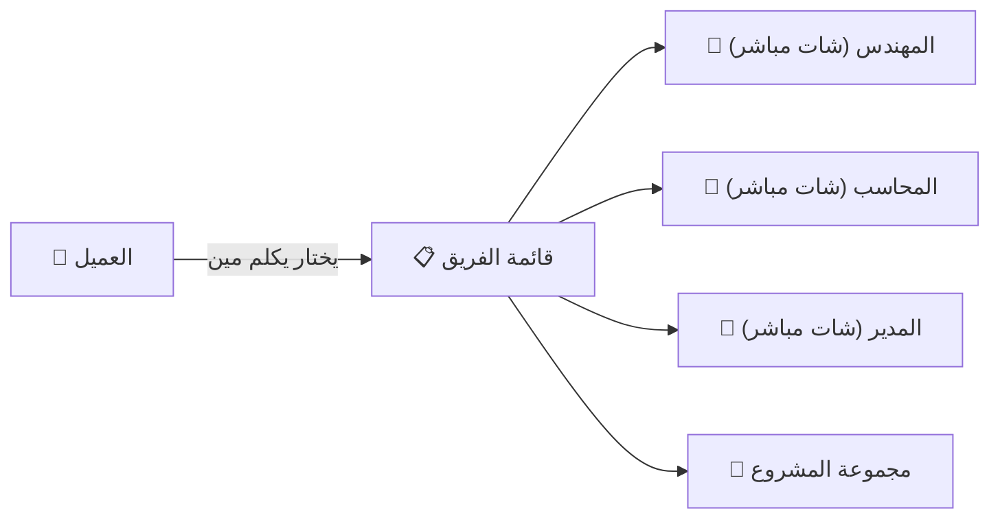

> [!NOTE]
> كل المحادثات موثقة ومحفوظة داخل النظام — نقطة قوة كبيرة لو حصل أي خلاف. لا حاجة للتواصل خارج المنصة.

---

### 2.11 💬 Comment System (نظام التعليقات)

| السمة | النوع | ملاحظات |
|---|---|---|
| `id` | UUID | المعرف الفريد |
| `update_id` | FK → Update | التحديث المعلّق عليه |
| `user_id` | FK → User | كاتب التعليق |
| `content` | Text | محتوى التعليق |
| `type` | Enum | `comment`, `review_request`, `change_request` |
| `status` | Enum (nullable) | `open`, `acknowledged`, `resolved` (لطلبات المراجعة) |
| `parent_id` | FK → Comment (nullable) | للردود المتسلسلة |
| `created_at` | Timestamp | وقت الإنشاء |
| `deleted_at` | Timestamp (nullable) | Soft delete |

> العميل يمكنه:
> - **تعليق عادي** (`comment`): ملاحظة على تحديث
> - **طلب مراجعة** (`review_request`): يطلب تفاصيل أكثر عن شيء معين
> - **طلب تغيير** (`change_request`): يطلب تعديل في العمل

---

### 2.12 👷 SubContractor (مقاولي الباطن)

| السمة | النوع | ملاحظات |
|---|---|---|
| `id` | UUID | المعرف الفريد |
| `company_id` | FK → Company | الشركة |
| `name` | String | اسم المقاول |
| `specialty` | String | التخصص (كهرباء، سباكة، نقاشة...) |
| `phone` | String | رقم التواصل |
| `email` | String (nullable) | البريد |
| `rating` | Decimal (1-5) | التقييم |
| `total_projects` | Integer | عدد المشاريع التي عمل فيها |
| `notes` | Text (nullable) | ملاحظات |
| `created_at` | Timestamp | تاريخ الإنشاء |
| `deleted_at` | Timestamp (nullable) | Soft delete |

#### PhaseSubContractor (ربط المقاول بالمرحلة)

| السمة | النوع | ملاحظات |
|---|---|---|
| `id` | UUID | المعرف الفريد |
| `phase_id` | FK → Phase | المرحلة |
| `sub_contractor_id` | FK → SubContractor | المقاول |
| `agreed_cost` | Decimal | التكلفة المتفق عليها |
| `actual_cost` | Decimal | التكلفة الفعلية |
| `status` | Enum | `active`, `completed`, `terminated` |
| `assigned_at` | Timestamp | تاريخ التعيين |

---

### 2.13 🔍 AuditLog (سجل المراجعة)

| السمة | النوع | ملاحظات |
|---|---|---|
| `id` | UUID | المعرف الفريد |
| `company_id` | FK → Company | الشركة |
| `user_id` | FK → User | من قام بالعملية |
| `user_role` | String | وظيفته وقت العملية |
| `entity_type` | String | نوع الكيان (update, payment, phase, project) |
| `entity_id` | UUID | ID الكيان |
| `action` | Enum | `create`, `update`, `delete`, `approve`, `reject`, `force_cancel`, `progress_override` |
| `old_values` | JSONB | القيم القديمة |
| `new_values` | JSONB | القيم الجديدة |
| `reason` | Text (nullable) | سبب التعديل (مطلوب في التعديلات الحساسة) |
| `ip_address` | String | عنوان IP |
| `user_agent` | String | متصفح المستخدم |
| `created_at` | Timestamp | الوقت |

> [!CAUTION]
> سجل المراجعة **لا يُحذف أبدًا** ولا يمكن تعديله — هو **Append-only**. هذا ضروري للحماية القانونية.

---

### 2.14 📄 UpdateVersion (إصدارات التحديث)

| السمة | النوع | ملاحظات |
|---|---|---|
| `id` | UUID | المعرف الفريد |
| `update_id` | FK → Update | التحديث الأصلي |
| `version_number` | Integer | رقم الإصدار |
| `snapshot` | JSONB | نسخة كاملة من بيانات التحديث وقت الحفظ |
| `changed_by` | FK → User | من قام بالتعديل |
| `change_reason` | Text (nullable) | سبب التعديل |
| `created_at` | Timestamp | وقت الحفظ |

---

### 2.15 ⏰ DailyUpdateTracker (متتبع التحديثات اليومية)

كيان جديد لتتبع التزام الموظفين بمواعيد التحديثات.

| السمة | النوع | ملاحظات |
|---|---|---|
| `id` | UUID | المعرف الفريد |
| `project_id` | FK → Project | المشروع |
| `user_id` | FK → User | الموظف |
| `date` | Date | التاريخ |
| `deadline` | Time | الموعد المحدد |
| `status` | Enum | `pending`, `submitted_on_time`, `submitted_late`, `missed` |
| `submitted_at` | Timestamp (nullable) | وقت التسليم الفعلي |
| `delay_minutes` | Integer (nullable) | دقائق التأخير |
| `notification_sent_to_admin` | Boolean | هل تم إبلاغ المدير؟ |

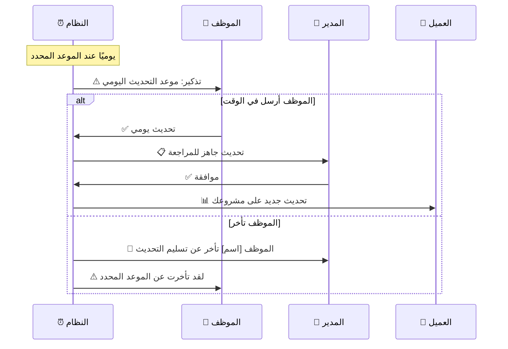

---

## 3. خريطة العلاقات الكاملة (Entity Relationships)

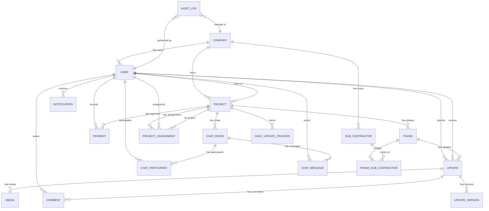

---

## 4. نظام الأدوار والصلاحيات المفصّل 🎭

### 4.1 هيكل الأدوار

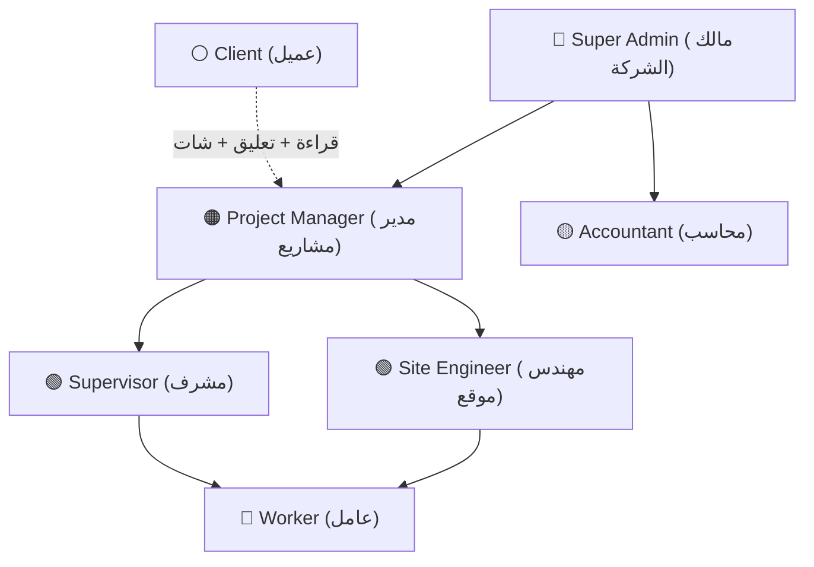

### 4.2 مصفوفة الصلاحيات التفصيلية

| الإجراء | Super Admin | Project Manager | Site Engineer | Supervisor | Accountant | Worker | Client |
|---|:---:|:---:|:---:|:---:|:---:|:---:|:---:|
| **إدارة الشركة والإعدادات** | ✅ | ❌ | ❌ | ❌ | ❌ | ❌ | ❌ |
| **إدارة المستخدمين** | ✅ | ❌ | ❌ | ❌ | ❌ | ❌ | ❌ |
| **إنشاء مشروع** | ✅ | ✅ | ❌ | ❌ | ❌ | ❌ | ❌ |
| **تعيين موظفين على مشروع** | ✅ | ✅ | ❌ | ❌ | ❌ | ❌ | ❌ |
| **إنشاء مراحل** | ✅ | ✅ | ❌ | ❌ | ❌ | ❌ | ❌ |
| **رفع تحديث يومي** | ✅ | ✅ | ✅ | ✅ | ✅ | ✅ | ❌ |
| **مراجعة واعتماد تحديثات** | ✅ | ✅ | ❌ | ❌ | ❌ | ❌ | ❌ |
| **رفض تحديث** | ✅ | ✅ | ❌ | ❌ | ❌ | ❌ | ❌ |
| **إلغاء قسري (Force Cancel)** | ✅ | ❌ | ❌ | ❌ | ❌ | ❌ | ❌ |
| **تعديل نسبة الإنجاز يدويًا** | ✅ | ✅ | ❌ | ❌ | ❌ | ❌ | ❌ |
| **تسجيل مدفوعات** | ✅ | ❌ | ❌ | ❌ | ✅ | ❌ | ❌ |
| **رؤية التكاليف التفصيلية** | ✅ | ✅ | ❌ | ❌ | ✅ | ❌ | 📊 ملخص |
| **تعديل تحديث معتمد (24 ساعة)** | ✅ | ✅ | ❌ | ❌ | ❌ | ❌ | ❌ |
| **رؤية التحديثات المعتمدة** | ✅ | ✅ | ✅ | ✅ | ✅ | ✅ | ✅ |
| **رؤية التحديثات المعلّقة/المرفوضة** | ✅ | ✅ | 📋 الخاصة به | 📋 الخاصة به | 📋 الخاصة به | 📋 الخاصة به | ❌ |
| **إضافة تعليق** | ✅ | ✅ | ✅ | ✅ | ✅ | ❌ | ✅ |
| **طلب مراجعة / تغيير** | ❌ | ❌ | ❌ | ❌ | ❌ | ❌ | ✅ |
| **استخدام الشات** | ✅ | ✅ | ✅ | ✅ | ✅ | ❌ | ✅ |
| **رؤية Analytics** | ✅ | ✅ | ❌ | ❌ | ✅ (مالية فقط) | ❌ | ❌ |
| **إدارة مقاولي الباطن** | ✅ | ✅ | ❌ | ❌ | ❌ | ❌ | ❌ |
| **رؤية Audit Log** | ✅ | ❌ | ❌ | ❌ | ❌ | ❌ | ❌ |

### 4.3 نظام Permission-Based مفصّل

بدل ما كل دور يكون ثابت الصلاحيات، النظام يعتمد على **مجموعات صلاحيات قابلة للتخصيص**:

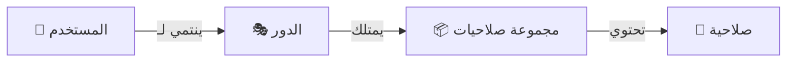

**كيف يعمل:**

```
الصلاحية = Resource + Action
مثال: projects.create, updates.approve, payments.view, chat.send
```

| المورد (Resource) | الإجراءات المتاحة (Actions) |
|---|---|
| `company` | `view`, `edit`, `manage_settings`, `manage_users`, `manage_billing` |
| `projects` | `view`, `create`, `edit`, `delete`, `assign_members`, `view_analytics` |
| `phases` | `view`, `create`, `edit`, `delete` |
| `updates` | `view_own`, `view_all`, `create`, `edit_draft`, `submit`, `approve`, `reject`, `force_cancel`, `edit_approved` |
| `payments` | `view_summary`, `view_detailed`, `create`, `edit` |
| `media` | `view`, `upload`, `delete` |
| `comments` | `view`, `create`, `create_review_request`, `create_change_request` |
| `chat` | `view`, `send`, `create_room` |
| `sub_contractors` | `view`, `create`, `edit`, `assign` |
| `audit_log` | `view` |
| `analytics` | `view_all`, `view_financial`, `view_performance` |

**الميزة**: الأدمن يمكنه إنشاء **أدوار مخصصة** بصلاحيات محددة بدل الأدوار الثابتة. مثلاً:
- "مهندس أول" = مهندس عادي + صلاحية اعتماد تحديثات
- "محاسب متقدم" = محاسب + رؤية analytics كاملة
- "مشرف ميداني" = رفع تحديثات + رؤية كل تحديثات مشاريعه

---

## 5. نظام المواعيد والتتبع (Deadline & SLA System) ⏰

### 5.1 آلية العمل

```mermaid
flowchart TD
    A["📅 بداية اليوم"] --> B{"هل الموظف معيّن لتحديث يومي؟"}
    B -->|نعم| C["⏰ إنشاء DailyUpdateTracker (status: pending)"]
    C --> D{"هل الموعد قارب (30 دقيقة)؟"}
    D -->|نعم| E["📱 تذكير للموظف"]
    E --> F{"هل تم التسليم قبل الموعد؟"}
    F -->|نعم| G["✅ submitted_on_time"]
    F -->|لا| H{"هل تم التسليم بعد الموعد؟"}
    H -->|نعم| I["⚠️ submitted_late + حساب التأخير"]
    H -->|لا (نهاية اليوم)| J["🚨 missed + إشعار عاجل للمدير"]
    I --> K["📊 تسجيل في تقرير الأداء"]
    J --> K
    G --> K
```

### 5.2 SLA Tracking

| المقياس | القاعدة | الإجراء عند الخرق |
|---|---|---|
| تسليم التحديث اليومي | قبل الموعد المتفق عليه | تذكير → إشعار المدير |
| مراجعة التحديث | خلال X ساعة (قابل للتخصيص) | إشعار تذكير للمراجع |
| الرد على طلب مراجعة العميل | خلال X ساعة | إشعار تصعيد |
| الرد على رسالة شات | خلال X ساعة (ساعات العمل) | إشعار المدير |

---

## 6. حساب نسبة الإنجاز 📊

### الآلية الهجينة

```
Phase Progress = Σ(approved updates' progress_increment for this phase)

Project Progress = Σ(Phase Progress × Phase Weight) / Σ(Phase Weights)
```

### قواعد التعديل اليدوي

عندما يعدّل الأدمن نسبة الإنجاز يدويًا:

1. ✅ يُسجّل في `AuditLog` مع:
   - `action`: `progress_override`
   - `user_id`: من عدّل
   - `user_role`: وظيفته
   - `reason`: سبب التعديل (**مطلوب**)
   - `old_values`: النسبة القديمة
   - `new_values`: النسبة الجديدة

2. ✅ Validation: `progress_increment` الإجمالي لا يتجاوز 100%

3. ✅ العميل يُبلّغ بأي تغيير في نسبة الإنجاز

---

## 7. Offline Support — لماذا صعب وكيف نعمله 📱

### لماذا هو صعب؟

| التحدي | الشرح |
|---|---|
| **Conflict Resolution** | لو شخصين عدّلوا نفس البيانات offline، أيهما يُعتمد عند المزامنة؟ |
| **Data Consistency** | البيانات المخزنة محليًا قد تكون قديمة — ممكن الموظف يعمل على مرحلة تم إلغاؤها |
| **Storage Limits** | الموبايل ذاكرته محدودة — لا يمكن تخزين كل الصور والفيديوهات محليًا |
| **Security** | البيانات المخزنة محليًا يجب تشفيرها — لو الموبايل ضاع أو اتسرق |
| **Sync Queue** | لازم Queue ذكي يعرف ترتيب العمليات ويتعامل مع الفشل |
| **UI Complexity** | المستخدم لازم يعرف إيه متزامن وإيه لسه — UX معقد |

### كيف نعمله (تدريجيًا)

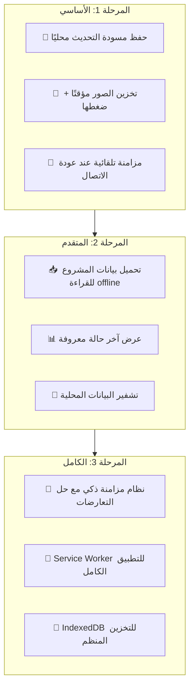

### الحل العملي للمرحلة الأولى

```
1. الموظف يفتح صفحة التحديث → البيانات تُحفظ في IndexedDB
2. يكتب التحديث + يرفع صور → كل شيء يُحفظ محليًا أولاً
3. الصور تُضغط تلقائيًا (من 5MB → 500KB تقريبًا)
4. عند عودة الاتصال → Background Sync يرفع كل شيء تلقائيًا
5. إشعار للموظف: "تم مزامنة تحديثاتك بنجاح ✅"
```

> [!TIP]
> **التوصية**: نبدأ بالمرحلة 1 فقط (حفظ مسودات + رفع صور) وهي تغطي 90% من الحاجة الفعلية في مواقع البناء.

---

## 8. تخزين الوسائط — خطة التسعير والتحسين 📸

### 8.1 خطط التخزين

| الخطة | حصة التخزين | السعر الشهري (مثال) | ملاحظات |
|---|---|---|---|
| **Basic** | 10 GB | $29 | كافية لـ 2-3 مشاريع صغيرة |
| **Pro** | 50 GB | $79 | 5-10 مشاريع متوسطة |
| **Enterprise** | 200 GB | $199 | مشاريع كبيرة + فيديو |
| **Custom** | حسب الطلب | Custom | شركات عملاقة |

### 8.2 تحسينات التخزين

| التحسين | التفاصيل | التوفير المتوقع |
|---|---|---|
| **ضغط الصور التلقائي** | WebP/AVIF بجودة 85% | 60-70% من الحجم الأصلي |
| **أحجام متعددة** | Thumbnail (150px) + Medium (800px) + Full | العرض السريع للـ Thumbnails |
| **ضغط الفيديو** | تحويل لـ H.265/HEVC + دقة محددة | 50-60% من الحجم |
| **Deduplication** | كشف الملفات المكررة ومنع الرفع المزدوج | 10-15% وفر |
| **Lifecycle Policies** | نقل ملفات المشاريع المكتملة > 6 أشهر لتخزين أرخص (Cold Storage) | 40% وفر في التكلفة |
| **CDN Caching** | تخزين مؤقت للملفات الأكثر طلبًا | تسريع التحميل 3-5x |
| **Lazy Loading + Pagination** | تحميل الصور عند الحاجة + تقسيم الصفحات | تقليل استهلاك البيانات |
| **Progressive Loading** | عرض صورة ضبابية ثم التفاصيل تدريجيًا | تحسين UX |
| **Client-side Compression** | ضغط الصور في المتصفح قبل الرفع | توفير bandwidth |

### 8.3 مؤشر الاستهلاك

```
📊 شريط الاستهلاك في Dashboard الأدمن:
██████████░░░░░░░░░░ 52% (26 GB / 50 GB)

⚠️ إشعار عند 80%: "مساحة التخزين توشك على الامتلاء"
🚨 إشعار عند 95%: "مساحة التخزين ممتلئة تقريبًا — قم بالترقية"
```

---

## 9. Supabase Auth vs بناء من الصفر 🔐

### المقارنة التفصيلية

| المعيار | Supabase Auth | بناء من الصفر |
|---|---|---|
| **وقت التطوير** | ⏱️ ساعات | ⏱️ أسابيع - أشهر |
| **تكلفة التطوير** | 💰 مجاني (ضمن Supabase) | 💰 مرتفعة جدًا |
| **الأمان** | ✅ مبني على GoTrue — مجرّب ومدقّق أمنيًا | ⚠️ مسؤوليتك 100% — أي خطأ = ثغرة |
| **JWT + Refresh Tokens** | ✅ جاهز | 🔨 تبنيه كامل |
| **OAuth (Google, GitHub...)** | ✅ بضغطة | 🔨 تكامل يدوي لكل provider |
| **MFA (المصادقة الثنائية)** | ✅ جاهز | 🔨 تبنيه كامل (TOTP, SMS) |
| **Rate Limiting** | ✅ مدمج | 🔨 تبنيه (Redis + middleware) |
| **Password Hashing** | ✅ bcrypt تلقائي | 🔨 لازم تختار خوارزمية وتنفذها |
| **Session Management** | ✅ مدمج | 🔨 تبنيه |
| **Email Verification** | ✅ جاهز | 🔨 تكامل مع email service |
| **Password Reset** | ✅ جاهز | 🔨 تبنيه |
| **RLS Integration** | ✅ تكامل مباشر مع PostgreSQL RLS | ⚠️ تبني Authorization layer كامل |
| **التخصيص** | ⚠️ محدود نسبيًا (لكن كافي) | ✅ كامل |
| **التحكم** | ⚠️ تعتمد على Supabase | ✅ كامل |
| **Scalability** | ✅ Supabase بيتكفل | ✅ لكن مسؤوليتك |

### التوصية النهائية

> [!IMPORTANT]
> **استخدم Supabase Auth** — الأسباب:
> 1. النظام يحتاج أمان عالي جدًا — Supabase Auth مبني على مكتبة مُدقّقة أمنيًا
> 2. توفير أسابيع من التطوير في ميزات مثل MFA, OAuth, Rate Limiting
> 3. التكامل المباشر مع RLS يعني أمان على مستوى قاعدة البيانات
> 4. لو احتجت تخصيص متقدم، يمكنك كتابة Custom Hooks في Edge Functions
> 
> **لو بنيت من الصفر**: ستحتاج فريق أمان متخصص لمراجعة الكود — هذا غير عملي للبداية

---

## 10. Row Level Security (RLS) — شرح مفصّل 🔒

### ما هو RLS؟

RLS هو نظام أمان **على مستوى الصفوف** في PostgreSQL. بدلاً من أن يتحكم الكود في من يرى ماذا، قاعدة البيانات نفسها تمنع الوصول غير المصرح.

### كيف يعمل — مثال عملي

```
بدون RLS:
──────────
SELECT * FROM projects;
→ يرجع كل المشاريع لكل الشركات! 😱

مع RLS:
────────
SELECT * FROM projects;
→ يرجع فقط مشاريع شركة المستخدم الحالي ✅
```

### كيف يتم هذا؟

```
CREATE POLICY "Users can only see their company's projects"
ON projects
FOR SELECT
USING (company_id = auth.jwt() ->> 'company_id');
```

هذا يعني: حتى لو في bug في الكود ونسيت تحط `WHERE company_id = X`، قاعدة البيانات **ترفض** إرجاع بيانات شركات أخرى.

### سياسات RLS للنظام

| الجدول | السياسة | الشرح |
|---|---|---|
| `projects` | `company_id = user.company_id` | كل شركة ترى مشاريعها فقط |
| `projects` (client) | `client_id = auth.uid()` | العميل يرى مشاريعه فقط |
| `updates` (client) | `status = 'approved'` | العميل يرى التحديثات المعتمدة فقط |
| `updates` (employee) | `submitted_by = auth.uid() OR status = 'approved'` | الموظف يرى تحديثاته + المعتمدة |
| `payments` | `company_id = user.company_id` | كل شركة ترى مدفوعاتها |
| `chat_messages` | `room_id IN (user's rooms)` | كل مستخدم يرى رسائل غرفه فقط |
| `audit_log` | `company_id = user.company_id AND role = 'super_admin'` | فقط السوبر أدمن يرى سجل المراجعة |

### لماذا RLS مهم جدًا لنظامنا؟

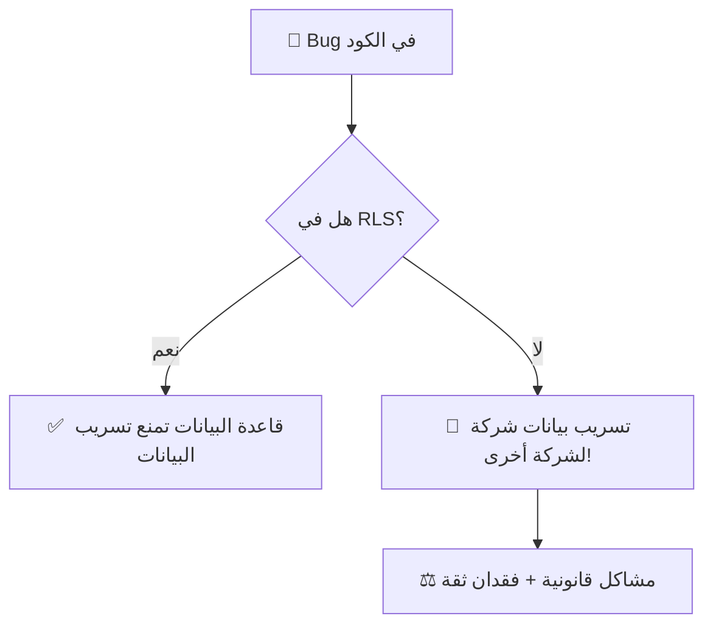

> [!CAUTION]
> بدون RLS، **خطأ واحد** في الكود (نسيان WHERE clause) يمكن أن يسرّب بيانات شركة كاملة لشركة أخرى. في نظام مقاولات يتعامل مع ملايين الجنيهات، هذا كارثي.

---

## 11. الأمان — Enterprise-Grade Security Architecture 🛡️

### 11.1 طبقات الأمان (Defense in Depth)

```mermaid
graph TD
    subgraph Layer1["🌐 الطبقة 1: الشبكة"]
        WAF["Web Application Firewall (Cloudflare WAF)"]
        DDoS["DDoS Protection"]
        SSL["TLS 1.3 (HTTPS فقط)"]
        HSTS["HSTS + Security Headers"]
    end

    subgraph Layer2["🔑 الطبقة 2: المصادقة"]
        Auth["Supabase Auth (JWT)"]
        MFA["المصادقة الثنائية (TOTP/SMS)"]
        Session["Session Management + Token Rotation"]
        Brute["Brute Force Protection (Rate Limiting)"]
    end

    subgraph Layer3["🎭 الطبقة 3: التفويض"]
        RBAC["Role-Based Access Control"]
        PBAC["Permission-Based Access Control"]
        RLS["Row Level Security (PostgreSQL)"]
        TenantIso["Tenant Isolation (company_id filter)"]
    end

    subgraph Layer4["💾 الطبقة 4: البيانات"]
        EncRest["Encryption at Rest (AES-256)"]
        EncTransit["Encryption in Transit (TLS)"]
        HashPwd["Password Hashing (bcrypt)"]
        PII["PII Protection (تشفير البيانات الحساسة)"]
    end

    subgraph Layer5["📋 الطبقة 5: المراقبة"]
        AuditLog["Audit Trail (كل عملية مسجلة)"]
        AnomalyDet["Anomaly Detection (أنماط غير طبيعية)"]
        AlertSys["نظام تنبيهات أمنية"]
        Logging["Centralized Logging"]
    end

    subgraph Layer6["🔄 الطبقة 6: الاستمرارية"]
        Backup["Automated Backups (يومي)"]
        DR["Disaster Recovery Plan"]
        IncResp["Incident Response Procedures"]
    end

    Layer1 --> Layer2 --> Layer3 --> Layer4 --> Layer5 --> Layer6
```

### 11.2 تفاصيل كل طبقة

#### الطبقة 1: أمان الشبكة

| الإجراء | التفاصيل |
|---|---|
| **WAF** | Cloudflare WAF يمنع هجمات SQL Injection, XSS, CSRF |
| **DDoS Protection** | حماية من هجمات الحرمان من الخدمة |
| **TLS 1.3** | كل الاتصالات مشفرة — HTTP ممنوع |
| **Security Headers** | `X-Frame-Options`, `X-Content-Type-Options`, `CSP`, `Referrer-Policy` |
| **CORS** | تحديد النطاقات المسموح لها بالاتصال |
| **IP Whitelisting** | اختياري: تحديد IPs المسموح لها (للـ Enterprise) |

#### الطبقة 2: المصادقة

| الإجراء | التفاصيل |
|---|---|
| **JWT + Refresh** | Access Token (15 دقيقة) + Refresh Token (7 أيام) |
| **Token Rotation** | Refresh Token يتغير مع كل استخدام |
| **MFA** | المصادقة الثنائية (إجبارية لـ Super Admin) |
| **Brute Force** | حظر بعد 5 محاولات فاشلة + CAPTCHA |
| **Password Policy** | الحد الأدنى 10 أحرف + أرقام + رموز |
| **Session Mgmt** | Concurrent sessions limit + Force logout |
| **Device Tracking** | تسجيل الأجهزة + تنبيه عند جهاز جديد |

#### الطبقة 3: التفويض

| الإجراء | التفاصيل |
|---|---|
| **RBAC** | أدوار محددة بصلاحيات (راجع القسم 4) |
| **Permission-Based** | صلاحيات دقيقة على مستوى العملية |
| **RLS** | قاعدة البيانات تمنع الوصول غير المصرح (راجع القسم 10) |
| **Tenant Isolation** | كل شركة معزولة تمامًا — لا يمكن الوصول لبيانات شركة أخرى |
| **Principle of Least Privilege** | كل مستخدم يحصل على الحد الأدنى من الصلاحيات |

#### الطبقة 4: حماية البيانات

| الإجراء | التفاصيل |
|---|---|
| **Encryption at Rest** | كل البيانات مشفرة على القرص (AES-256) |
| **Encryption in Transit** | TLS 1.3 لكل الاتصالات |
| **Password Hashing** | bcrypt مع salt (عبر Supabase Auth) |
| **Signed URLs** | ملفات الوسائط محمية بروابط مؤقتة (تنتهي بعد ساعة) |
| **Input Validation** | تحقق من كل المدخلات (حجم، نوع، محتوى) |
| **SQL Injection Prevention** | Parameterized queries + RLS |

#### الطبقة 5: المراقبة والكشف

| الإجراء | التفاصيل |
|---|---|
| **Audit Trail** | كل عملية حساسة مسجلة (من، ماذا، متى، من أين) |
| **Anomaly Detection** | كشف أنماط غير طبيعية (مثلاً: 100 طلب في ثانية) |
| **Failed Login Monitoring** | تتبع محاولات الدخول الفاشلة |
| **Data Access Logging** | تسجيل من وصل لأي بيانات حساسة |
| **Real-time Alerts** | تنبيه فوري عند اكتشاف سلوك مشبوه |

#### الطبقة 6: الاستمرارية

| الإجراء | التفاصيل |
|---|---|
| **Daily Backups** | نسخ احتياطية يومية تلقائية |
| **Point-in-Time Recovery** | استعادة لأي لحظة في آخر 7 أيام |
| **Multi-Region Backup** | نسخ في أكثر من منطقة جغرافية |
| **Disaster Recovery** | خطة استعادة كاملة مع RTO < 4 ساعات |

---

## 12. الهيكل التقني الكامل (Architecture) 🏛️

### 12.1 الهندسة المعمارية المنفصلة

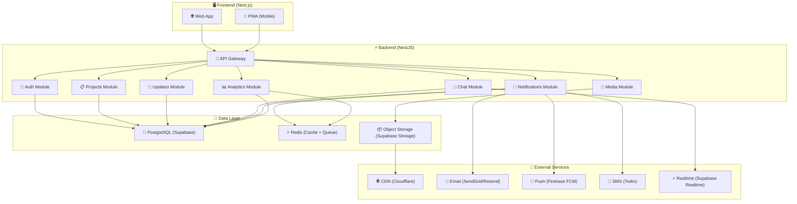

### 12.2 لماذا فصل الـ Backend عن الـ Frontend؟

| السبب | الشرح |
|---|---|
| **Scalability** | كل جزء يتوسع بشكل مستقل — لو الـ API تحت ضغط، تزيد سيرفراته بدون تأثير على الـ Frontend |
| **Security** | الـ Backend يعمل كـ Security Layer — لا يتصل الـ Frontend بقاعدة البيانات مباشرة |
| **Team Collaboration** | فريق Frontend وفريق Backend يعملون بشكل مستقل |
| **Mobile Ready** | نفس الـ API يخدم الويب والموبايل |
| **Testability** | كل جزء يُختبر بشكل مستقل |
| **Maintenance** | تعديل الـ UI لا يؤثر على المنطق، والعكس |

### 12.3 هيكل المشروع (Project Structure)

```
saas-one/
├── packages/                    # Shared packages
│   ├── shared-types/           # TypeScript types مشتركة
│   └── shared-utils/           # دوال مساعدة مشتركة
│
├── apps/
│   ├── web/                    # Frontend (Next.js 15)
│   │   ├── src/
│   │   │   ├── app/           # App Router pages
│   │   │   ├── components/    # UI components
│   │   │   ├── features/      # Feature modules
│   │   │   ├── hooks/         # Custom hooks
│   │   │   ├── lib/           # Utilities
│   │   │   ├── stores/        # State management (Zustand)
│   │   │   ├── styles/        # Global styles
│   │   │   └── i18n/          # Translations (ar/en)
│   │   ├── public/
│   │   └── next.config.js
│   │
│   └── api/                    # Backend (NestJS)
│       ├── src/
│       │   ├── modules/
│       │   │   ├── auth/      # Authentication
│       │   │   ├── companies/ # Company management
│       │   │   ├── projects/  # Projects CRUD
│       │   │   ├── phases/    # Phases CRUD
│       │   │   ├── updates/   # Updates + workflow
│       │   │   ├── media/     # File upload/processing
│       │   │   ├── payments/  # Financial operations
│       │   │   ├── chat/      # Real-time chat
│       │   │   ├── notifications/ # Notification system
│       │   │   ├── analytics/ # Dashboards & reports
│       │   │   ├── audit/     # Audit trail
│       │   │   └── admin/     # System administration
│       │   ├── common/
│       │   │   ├── guards/    # Auth & Role guards
│       │   │   ├── decorators/# Custom decorators
│       │   │   ├── filters/   # Exception filters
│       │   │   ├── interceptors/ # Request/Response interceptors
│       │   │   ├── pipes/     # Validation pipes
│       │   │   └── middleware/# Tenant isolation middleware
│       │   ├── config/        # Configuration
│       │   └── database/      # Database setup + migrations
│       └── test/              # Tests
│
├── supabase/                   # Supabase config
│   ├── migrations/            # SQL migrations
│   ├── functions/             # Edge Functions
│   └── config.toml
│
├── docker-compose.yml          # Local development
├── turbo.json                  # Monorepo config (Turborepo)
└── package.json
```

---

## 13. التقنيات المستخدمة — مقارنة وتبرير 🔧

### 13.1 Frontend

| التقنية | الاختيار | لماذا؟ | البدائل | لماذا لا البدائل؟ |
|---|---|---|---|---|
| **Framework** | **Next.js 15** | SSR + SSG + App Router + SEO ممتاز + Image Optimization | Nuxt.js, Remix, SvelteKit | Next.js أكبر نظام بيئي + أكثر دعم + وظائف مدمجة أكثر |
| **Language** | **TypeScript** | Type Safety = أخطاء أقل = أمان أكثر | JavaScript | TypeScript ضروري في مشاريع كبيرة — يمنع 30%+ من الأخطاء |
| **State Mgmt** | **Zustand** | بسيط + خفيف + سريع | Redux, Jotai, MobX | Redux معقد جدًا لحجمنا، Zustand يعطي نفس القوة ببساطة |
| **Data Fetching** | **TanStack Query** | Caching + Updates ذكية + Optimistic Updates | SWR, Apollo | TanStack أقوى في الـ mutations والتعامل مع REST |
| **Styling** | **Tailwind CSS v4** | سرعة تطوير + تنظيم + حجم صغير | CSS Modules, Styled-Components | Tailwind أسرع في التطوير وأسهل في الصيانة + RTL support |
| **Components** | **Radix UI + shadcn/ui** | Accessible + Customizable + Headless | Material UI, Ant Design, Chakra | shadcn يعطي تحكم كامل في الشكل بدون قيود مكتبة |
| **Forms** | **React Hook Form + Zod** | أداء عالي + Validation قوي | Formik | React Hook Form أسرع بـ 3x في الأداء |
| **i18n** | **next-intl** | مدمج مع Next.js App Router + RTL | i18next | next-intl مصمم خصيصًا لـ Next.js |
| **Charts** | **Recharts** | سهل + Responsive + مبني على D3 | Chart.js, ECharts | Recharts مبني لـ React — تكامل أفضل |

### 13.2 Backend

| التقنية | الاختيار | لماذا؟ | البدائل | لماذا لا البدائل؟ |
|---|---|---|---|---|
| **Framework** | **NestJS** | بنية قوية (Modular) + TypeScript + DI + Guards + Interceptors | Express, Fastify, Hono | NestJS يعطي بنية Enterprise-grade جاهزة — Express بدون بنية |
| **ORM** | **Prisma** | Type-safe queries + Auto-generated types + Migration system | TypeORM, Drizzle, Knex | Prisma أقوى في الـ type safety والـ DX وأسهل |
| **Validation** | **class-validator + class-transformer** | مدمج مع NestJS + Decorators | Zod, Joi | مدمج أفضل مع NestJS ecosystem |
| **Queue** | **BullMQ (Redis)** | جدولة مهام + معالجة غير متزامنة + Retry | Agenda, RabbitMQ | BullMQ أبسط وأقوى لحجمنا + مبني على Redis |
| **WebSocket** | **Supabase Realtime + Socket.io** | Chat + Notifications في الوقت الحقيقي | Pusher, Ably | Supabase Realtime مجاني ومدمج مع قاعدة البيانات |
| **File Processing** | **Sharp** | ضغط وقص الصور بأداء عالٍ | Jimp, ImageMagick | Sharp 5-10x أسرع من البدائل |
| **Email** | **Resend** | DX ممتاز + Templates + Reliability | SendGrid, Mailgun | Resend أحدث + أبسط API + أرخص |
| **Testing** | **Jest + Supertest** | مدمج مع NestJS + E2E testing | Vitest, Mocha | Jest هو الـ default في NestJS |

### 13.3 Database & Infrastructure

| التقنية | الاختيار | لماذا؟ | البدائل | لماذا لا البدائل؟ |
|---|---|---|---|---|
| **Database** | **PostgreSQL (Supabase)** | RLS + JSONB + مستقر + أداء عالي | MySQL, MongoDB | PostgreSQL أقوى في الأمان (RLS) وأكثر ميزات |
| **Cache** | **Redis** | سرعة فائقة + Queue + Pub/Sub + Sessions | Memcached | Redis أكثر ميزات — يعمل كـ cache + queue + pub/sub |
| **Storage** | **Supabase Storage (S3)** | مدمج + RLS على الملفات + CDN | AWS S3, Cloudinary | Supabase Storage أبسط + تكامل مباشر مع Auth |
| **CDN** | **Cloudflare** | سريع + WAF + DDoS Protection + مجاني | CloudFront, Fastly | Cloudflare يعطي أمان + CDN معًا |
| **Hosting** | **Vercel (Frontend) + Railway/Fly.io (Backend)** | Serverless + Edge Functions + Auto-scaling | AWS, GCP, Azure | أسهل في الإدارة ولا تحتاج DevOps متخصص |
| **Monorepo** | **Turborepo** | Build caching + Parallel execution + خفيف | Nx, Lerna | Turborepo أبسط وأسرع — من Vercel |
| **CI/CD** | **GitHub Actions** | مجاني + مدمج مع GitHub + سهل | GitLab CI, Jenkins | GitHub Actions أبسط إعداد وأكثر انتشارًا |
| **Monitoring** | **Sentry + Supabase Dashboard** | Error tracking + Performance monitoring | Datadog, New Relic | Sentry مجاني للمشاريع الصغيرة/المتوسطة |

---

## 14. أداء قاعدة البيانات — اقتراحات متقدمة ⚡

### 14.1 Indexing Strategy

| Index | الجدول | الأعمدة | السبب |
|---|---|---|---|
| **Tenant Filter** | كل الجداول | `company_id` | كل query يفلتر بالشركة |
| **Update Lookup** | `updates` | `(company_id, phase_id, status)` | الاستعلام الأكثر تكرارًا |
| **Project Status** | `projects` | `(company_id, status, created_at)` | لوحة المشاريع |
| **Timeline** | `updates` | `(phase_id, submitted_at DESC)` | عرض التايملاين |
| **Chat Messages** | `chat_messages` | `(room_id, created_at DESC)` | تحميل الرسائل |
| **Notifications** | `notifications` | `(user_id, is_read, created_at DESC)` | عداد الإشعارات |
| **Daily Tracker** | `daily_update_tracker` | `(project_id, date, status)` | تتبع المواعيد |
| **Audit Search** | `audit_log` | `(company_id, entity_type, created_at DESC)` | بحث في سجل المراجعة |
| **Full Text** | `updates` | GIN index on `description, work_done` | بحث نصي سريع |

### 14.2 Query Optimization

| الاستراتيجية | الشرح |
|---|---|
| **Materialized Views** | لوحة الإحصائيات (progress, costs) — تُحدّث كل 5 دقائق بدل حساب في كل request |
| **Computed Columns** | `overall_progress` يُحفظ ويُحدّث عند تغيير phase progress |
| **Cursor-based Pagination** | بدل `OFFSET/LIMIT` (بطيء مع بيانات كبيرة) |
| **Selective Fields** | `SELECT` الحقول المطلوبة فقط — لا `SELECT *` |
| **Connection Pooling** | PgBouncer في Supabase لإدارة الاتصالات |
| **Read Replicas** | نسخة قراءة لـ Analytics والاستعلامات الثقيلة |

### 14.3 Caching Strategy (Redis)

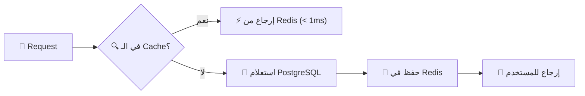

| البيانات | مدة الـ Cache | سبب |
|---|---|---|
| بيانات المشروع | 5 دقائق | تتغير نادرًا |
| صلاحيات المستخدم | 15 دقيقة | تتغير نادرًا جدًا |
| آخر التحديثات | 1 دقيقة | تتغير بشكل متوسط |
| الإحصائيات | 5 دقائق | حساب مكلف |
| عدد الإشعارات غير المقروءة | 30 ثانية | يحتاج تحديث سريع |
| بيانات الشركة | 30 دقيقة | نادرًا ما تتغير |

### 14.4 Table Partitioning

| الجدول | طريقة التقسيم | السبب |
|---|---|---|
| `updates` | بالشهر (`submitted_at`) | الجدول الأكبر — ملايين الصفوف |
| `audit_log` | بالشهر (`created_at`) | ينمو بسرعة — append-only |
| `notifications` | بالشهر (`created_at`) | كثير جدًا — وأغلبه قديم |
| `chat_messages` | بالشهر (`created_at`) | ينمو بسرعة مع الشات |

### 14.5 Archiving Strategy

```
المشاريع المكتملة > 12 شهر:
→ نقل الوسائط لـ Cold Storage (أرخص بـ 60%)
→ نقل التحديثات لـ Archive Tables
→ تبقى البيانات الأساسية في الجداول الرئيسية
→ يمكن الوصول لكل شيء من صفحة "الأرشيف"
```

---

## 15. Analytics Dashboard 📊

| المقياس | الشرح | المستلم |
|---|---|---|
| **متوسط وقت إنجاز المشروع** | حسب النوع (تشطيب كامل، جزئي...) | Admin |
| **معدل التأخير** | نسبة المشاريع المتأخرة عن الموعد | Admin |
| **تكلفة الانحراف** | الفرق بين الميزانية والتكلفة الفعلية | Admin + Accountant |
| **أداء الموظفين** | نسبة الالتزام بالمواعيد، معدل الموافقة | Admin |
| **رضا العملاء** | عدد طلبات المراجعة / التغيير | Admin |
| **SLA Compliance** | نسبة الالتزام بمعايير الخدمة | Admin |
| **تقرير مقاولي الباطن** | أداء كل مقاول + تقييم | Admin |
| **تقرير مالي** | إيرادات vs مصروفات per project | Admin + Accountant |
| **تقدم المشاريع** | Timeline + نسب إنجاز + صور | Client |

---

## 16. خارطة طريق التنفيذ 🗺️

### المرحلة 1: الأساس (MVP) — 6-8 أسابيع
| الميزة | الأولوية |
|---|---|
| إعداد المشروع (Monorepo + CI/CD) | 🔴 حرج |
| تصميم قاعدة البيانات + RLS | 🔴 حرج |
| تسجيل الشركات والمستخدمين | 🔴 حرج |
| نظام الأدوار والصلاحيات | 🔴 حرج |
| إدارة المشاريع والمراحل | 🔴 حرج |
| نظام التحديثات (Draft → Pending → Approved/Rejected) | 🔴 حرج |
| رفع الصور مع الضغط التلقائي | 🔴 حرج |
| Dashboard العميل (Read + Comment) | 🔴 حرج |
| الإشعارات الأساسية (In-App) | 🟡 مهم |
| Audit Trail | 🟡 مهم |

### المرحلة 2: التوسع — 4-6 أسابيع
| الميزة | الأولوية |
|---|---|
| نظام المدفوعات والتكاليف | 🔴 حرج |
| نظام المواعيد والتتبع (Deadlines) | 🔴 حرج |
| نظام الشات (1-1 + مجموعات) | 🟡 مهم |
| طلبات المراجعة والتغيير من العميل | 🟡 مهم |
| Push Notifications + Email | 🟡 مهم |
| رفع فيديوهات + ضغط | 🟢 تحسين |
| Document Versioning | 🟢 تحسين |

### المرحلة 3: النضج — 4-6 أسابيع
| الميزة | الأولوية |
|---|---|
| مقاولي الباطن | 🟡 مهم |
| Analytics Dashboard متقدم | 🟡 مهم |
| SLA Tracking | 🟡 مهم |
| تقارير PDF | 🟢 تحسين |
| Permission-based system (أدوار مخصصة) | 🟢 تحسين |
| Offline Support (المرحلة 1) | 🟢 تحسين |

### المرحلة 4: التوسع الكبير
| الميزة | الأولوية |
|---|---|
| تطبيق موبايل (React Native / PWA) | 🟡 مهم |
| Integration APIs (للربط مع أنظمة أخرى) | 🟢 تحسين |
| White-label (تخصيص الشكل لكل شركة) | 🟢 تحسين |
| AI-powered insights | 🟢 تحسين |

---

## 17. ملخص تنفيذي نهائي

| البند | القرار |
|---|---|
| **النوع** | Multi-tenant SaaS (Shared Schema + RLS) |
| **Architecture** | Monorepo مع فصل كامل (Frontend / Backend / Database) |
| **Frontend** | Next.js 15 + TypeScript + Tailwind + shadcn/ui |
| **Backend** | NestJS + TypeScript + Prisma |
| **Database** | PostgreSQL via Supabase |
| **Cache** | Redis (BullMQ + Caching) |
| **Auth** | Supabase Auth (JWT + MFA + RLS) |
| **Storage** | Supabase Storage + CDN (Cloudflare) |
| **Realtime** | Supabase Realtime + Socket.io |
| **Notifications** | In-App + Push (FCM) + Email (Resend) |
| **Security** | 6 طبقات أمان (Enterprise-grade) |
| **Monitoring** | Sentry + Supabase Dashboard |
| **CI/CD** | GitHub Actions + Turborepo |
| **Hosting** | Vercel (Frontend) + Railway (Backend) |
| **اللغة** | عربي + إنجليزي (RTL/LTR) |
| **المقياس المستهدف** | آلاف الشركات + ملايين المستخدمين |

> [!NOTE]
> هذا التحليل النهائي المحدّث بناءً على جميع الملاحظات. بعد الموافقة، سننتقل مباشرة لتصميم قاعدة البيانات التفصيلية ثم التنفيذ.
